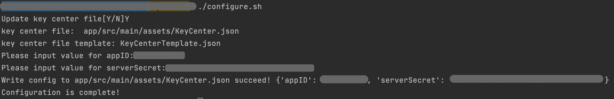

# ZEGO Call

ZEGOCLOUD's Voice Call and Video Call let you build high-quality voice and video calls into apps that fit various needs of different scenarios, including social interactions, work collaboration, customer services, and more.

## Getting started 

Before getting started with the ZEGO Call application, **contact us to activate the ZEGO Call (RTC) service**, and then do the following:

### Prerequisites

* [Android Studio 2020.3.1 or later](https://developer.android.com/studio)
* Android SDK Packages: Android SDK 30, Android SDK Platform-Tools 30.x.x or later.
* An Android device or Simulator that is running on Android 4.1 or later and supports audio and video. We recommend you use a real device (Remember to enable **USB debugging** for the device).
* Create a project in [ZEGOCLOUD Admin Console](https://console.zegocloud.com/). For details, see [ZEGO Admin Console - Project management](https://docs.zegocloud.com/article/1271).


### Modify the project configurations

1. Clone the ZEGO Call Github repository.
2. Open Terminal, navigate to the cloned project repository.
3. Run the configuration script with the `./configure.sh` command. And fill in the AppID, and ServerSecret, which can be obtained in the [ZEGO Admin Console](https://console.zegocloud.com/). 
**Note**: If you are using Windows system, double-click the `configure.bat` to run the configuration script.   

4. follow the instruction to config firebase to this project,download the google-services.json to app directory.


### Run the sample code
Note: To run the sample code successfully, you will need to upgrade to Java 11 if the JRE you are using is Java 8 version. To do so, refer to the following:
https://developer.android.com/studio/intro/studio-config#jdk


1. Open the ZEGO Call project in Android Studio.
2. Make sure the developer mode and USB debugging are enabled for the Android device, and connect the Android device to your computer.
3. If the **Running Devices** box in the upper area changes to the device name you are using, which means you are ready to run the sample code.  
4. Run the sample code on your device to experience the ZEGO Call service.  


### Project structure
The project consists of three modules: **app ,zegocalluikit and zegocall**.

#### app
The app module implements the business and UI interaction logic, including login, contact list and more. The following shows the structure:

Directory path: 
{your_project_root_path}/call_android/app/src/main/java/im/zego/call:
```
.
├── App.java (application)            
├── MyFirebaseMessagingService.java (fcm service)
├── UIKitActivity.java
├── auth
│   └── AuthInfoManager.java (read appID from file)
├── firebase
│   └── FirebaseUserManager.java (firebase auth)
├── token
│   └── ZegoTokenManager.java  (get token from cloud function)
├── ui
│   ├── entry
│   │   └── EntryActivity.java (welcome page )
│   ├── login
│   │   └── GoogleLoginActivity.java (login)
│   ├── setting
│   │   └── SettingActivity.java
│   ├── user
│   │   ├── OnlineUserActivity.java  (userlist)
│   │   └── OnlineUserAdapter.java
│   └── webview
│       └── WebViewActivity.java
└── utils
    ├── HeadsetMonitor.java
    └── OnRecyclerViewItemTouchListener.java


```
#### zegocalluikit

The app module implements the basic UI and logic of call. The following shows the structure:

Directory path: 
{your_project_root_path}/call_android/zegocalluikit/src/main/java/im/zego/calluikit:

.
├── ForegroundService.java
├── IZegoCallManager.java
├── ZegoCallManager.java     (entry)
├── ZegoCallManagerListener.java  
├── ZegoTokenProvider.java
├── constant
│   └── Constants.java
├── ui
│   ├── BaseActivity.java
│   ├── call
│   │   ├── CallActivity.java      (main UI of call)
│   │   ├── CallStateManager.java
│   │   └── view
│   │       ├── ConnectedVideoCallView.java  (video call UI)
│   │       ├── ConnectedVoiceCallView.java  (voice call UI)
│   │       ├── IncomingCallView.java        (incoming call UI)
│   │       └── OutgoingCallView.java        (outgoing call UI)
│   ├── common
│   │   ├── FloatDialog.java         
│   │   ├── LoadingDialog.java
│   │   ├── MinimalDialog.java      (minimal call dialog)
│   │   ├── MinimalStatus.java
│   │   ├── MinimalView.java
│   │   ├── ReceiveCallDialog.java   (receive call dialog)
│   │   ├── ReceiveCallView.java
│   │   └── TipsDialog.java
│   ├── dialog
│   │   ├── CommonStringArrayDialog.java
│   │   ├── VideoSettingsDialog.java     (video config dialog)
│   │   └── base
│   │       ├── BaseBottomDialog.java
│   │       └── BaseDialog.java
│   ├── model
│   │   └── VideoSettingConfig.java
│   └── viewmodel
│       └── VideoConfigViewModel.java
├── utils
│   ├── AudioHelper.java
│   ├── AvatarHelper.java
│   ├── PermissionHelper.java
│   └── RomPermissionCheckUtils.java
└── view
    ├── VideoSettingCellView.java
    └── ZegoCallKitView.java


#### zegocall
The zegocall improves reusability and further encapsulates the RTC, for you to integrate easier. The following shows the structure:

Directory path: 
{your_project_root_path}/call_android/zegocall/src/main/java/im/zego/callsdk:

```
.
├── auth
│   ├── Base64.java
│   └── TokenServerAssistant.java
├── callback
│   ├── ZegoCallback.java
│   ├── ZegoNotifyListener.java
│   ├── ZegoRequestCallback.java
│   └── ZegoTokenCallback.java
├── command
│   ├── ZegoCommandManager.java
│   └── ZegoRequestProtocol.java
├── core
│   ├── commands    (comands to firebase interface)
│   │   ├── ZegoAcceptCallCommand.java
│   │   ├── ZegoCallCommand.java
│   │   ├── ZegoCancelCallCommand.java
│   │   ├── ZegoCommand.java
│   │   ├── ZegoDeclineCallCommand.java
│   │   ├── ZegoEndCallCommand.java
│   │   └── ZegoHeartBeatCommand.java
│   ├── interfaceimpl
│   │   ├── ZegoCallServiceImpl.java    (call relative logic)
│   │   ├── ZegoDeviceServiceImpl.java  (RTC interface to camera,audio,speakers,etc.)
│   │   ├── ZegoRoomServiceImpl.java    (RTC interface to joinroom,leave room,etc.)
│   │   ├── ZegoStreamServiceImpl.java  (RTC interface to stream operation,etc.)
│   │   └── ZegoUserServiceImpl.java    (user status sync)
│   ├── interfaces
│   │   ├── ZegoCallService.java
│   │   ├── ZegoDeviceService.java
│   │   ├── ZegoRoomService.java
│   │   ├── ZegoStreamService.java
│   │   └── ZegoUserService.java
│   └── manager
│       └── ZegoServiceManager.java     (entry of call)
├── listener
│   ├── ZegoCallServiceListener.java
│   ├── ZegoDeviceServiceListener.java
│   ├── ZegoListener.java
│   ├── ZegoListenerManager.java
│   ├── ZegoListenerUpdater.java
│   ├── ZegoRoomServiceListener.java
│   └── ZegoUserServiceListener.java
├── model
│   ├── DatabaseCall.java
│   ├── DatabaseUser.java
│   ├── ZegoAudioBitrate.java
│   ├── ZegoCallInfo.java
│   ├── ZegoCallTimeoutType.java
│   ├── ZegoCallType.java
│   ├── ZegoCallingState.java
│   ├── ZegoDeclineType.java
│   ├── ZegoDevicesType.java
│   ├── ZegoLocalUserStatus.java
│   ├── ZegoNetWorkQuality.java
│   ├── ZegoRoomInfo.java
│   ├── ZegoUserInfo.java
│   └── ZegoVideoResolution.java
├── request
│   └── ZegoFirebaseManager.java    (firebase implement of interface)
└── utils
    ├── CallUtils.java
    ├── CustomTypeAdapterFactory.java
    ├── ZegoCallErrorCode.java      (error code define)
    └── ZegoCallHelper.java

```

## More documentation
You can find more documentation on our official website: [Voice and Video Call](https://docs.zegocloud.com/article/13840).
