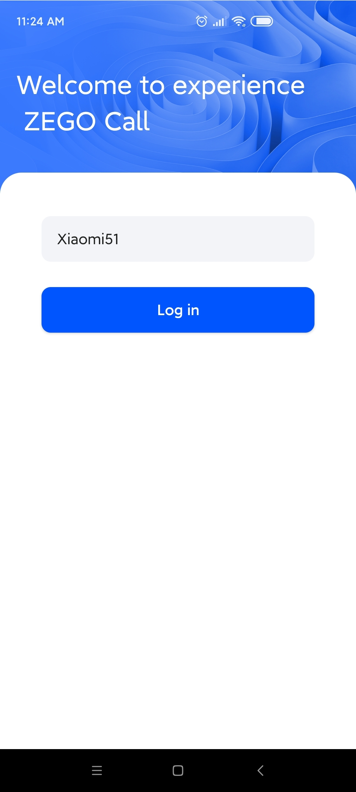

# ZEGO Call

ZEGOCLOUD's Voice Call and Video Call let you build high-quality voice and video calls into apps that fit various needs of different scenarios, including social interactions, work collaboration, customer services, and more.

## Getting started 

Before getting started with the ZEGO Call application, **contact us to activate the ZEGO Call (RTC + IM) service**, and then do the following:

### Prerequisites

* [Android Studio 2020.3.1 or later](https://developer.android.com/studio)
* Android SDK Packages: Android SDK 30, Android SDK Platform-Tools 30.x.x or later.
* An Android device or Simulator that is running on Android 4.1 or later and supports audio and video. We recommend you use a real device (Remember to enable **USB debugging** for the device).
* Create a project in [ZEGOCLOUD Admin Console](https://console.zegocloud.com/). For details, see [ZEGO Admin Console - Project management](https://docs.zegocloud.com/article/1271).


### Modify the project configurations

1. Clone the ZEGO Call Github repository.
2. Open Terminal, navigate to the cloned project repository.
3. Run the configuration script with the `./configure.sh` command. And fill in the AppID, AppSign, and ServerSecret, which can be obtained in the [ZEGO Admin Console](https://console.zegocloud.com/).  
**Note**: If you are using Windows system, double-click the `configure.bat` to run the configuration script.   


### Run the sample code

1. Open the ZEGO Call project in Android Studio.
2. Make sure the developer mode and USB debugging are enabled for the Android device, and connect the Android device to your computer.
3. If the **Running Devices** box in the upper area changes to the device name you are using, which means you are ready to run the sample code.  
4. Run the sample code on your device to experience the ZEGO Call service.  


### Project structure
The project consists of two modules: **app and zegocall**.

#### app
The app module implements the business and UI interaction logic, including login, contact list, calling, and more. The following shows the structure:

Directory path: 
{your_project_root_path}/call_android/app/src/main/java/im/zego/call:
```
.
├── App.java                ------ App init and SDK initialization
├── auth                ------ Tools for generating the token used for validating the login, room joining privileges 
├── http                ------ The logic for initiating network requests to business server
├── service                ------ Frontend service (to keep the app alive in the backend, prevent the app from being killed)
├── ui
│ ├── call                ------ The showing page when making calls
│ ├── common                ------ Common customizable UI logic
│ ├── entry                ------ The Welcome page
│ ├── login                ------ Login
│ ├── setting                ------ The Settings page
│ ├── user                ------ The online contacts page
│ └── webview                ------ Web pages presented within the app
└── utils           ------ Utilities
```

#### zegocall
The zegocall improves reusability and further encapsulates the RTC, IM for you to integrate easier. The following shows the structure:

Directory path: 
{your_project_root_path}/call_android/zegocall/src/main/java/im/zego/callsdk:

```
.
├── ZegoZIMManager.java                ------ The ZIM instances for the SDK use.
├── callback
├── listener
├── model
├── service
│ ├── ZegoRoomManager.java                ------ Room related instances that used to initialize the SDK, and provide the capabilities for service implementation.
│ ├── ZegoRoomService.java                ------ Room related service, such as join/leave a room, update room information, and more.
│ └── ZegoUserService.java                ------ User related service, such as start/end call, turn on/off the microphone/camera, and more.
└── utils
```

## More documentation
You can find more documentation on our official website: [Voice and Video Call](https://docs.zegocloud.com/article/13840).
